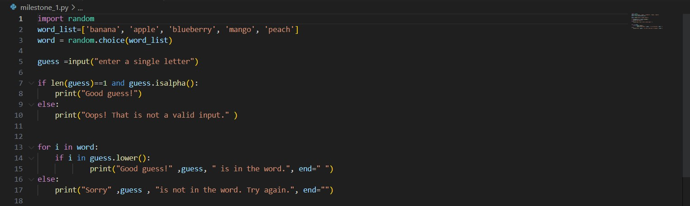
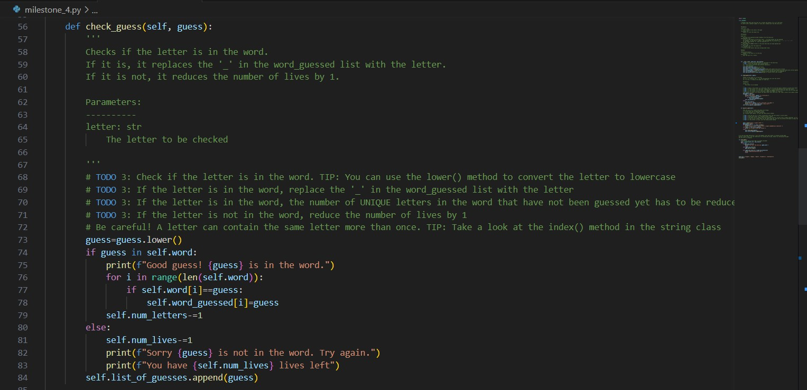
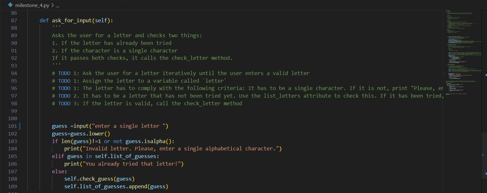
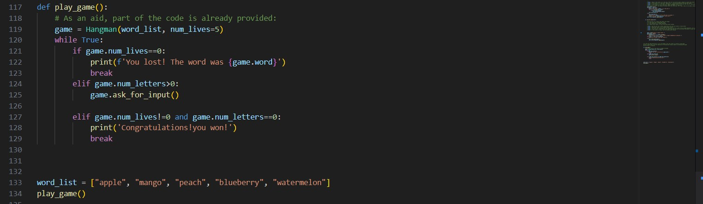

# Hangman
Hangman is a classic game in which a player thinks of a word and the other player tries to guess that word within a certain amount of attempts.

This is an implementation of the Hangman game, where the computer thinks of a word and the user tries to guess it. 

## Milestone 1 and 2
In milestone 1 and 2 I set up a list of 5 fruits and using the random module created a variable word which would pick a random fruit from the list. I also created an input called guess, to guess a single letter. Then created an if condition checking if the letter has length 1 and is a letter in the alphabet.

## Milestone 3
In milestone_3 I created the check_guess() method passing guess as a parameter. I converted the guess to lowercase and created an if statement that checks if guess is in the word. I then created a for loop which that loops through each letter in the word and within the for loop created an if statement to check if the letter is equal to the guess. Ig the guess is correct the corresponding '-' dash is replaced with the guess using indexing. Outside the for loop I reduced the number of guesses by one if the guess is not in the word. The user is then notified via a print statement and asked to input another guess.

I also defined a method called ask_for_input().In the body of the method I used a while loop which asks the user to guess a letter via an input. It then checks if the letter is in the alphabet and if the length is one. If the guess is already in the list_of_guesses the user is promted to choose another. Following this, I created an else block to call the check_guess() method. Finally appending guess to list_of_guesses. 

## Milestone 4
In milestone_4 I created a class with 2 methods, one that will ask the user to guess a letter and another method that will check if the guess is in the word. I first created a class called Hangman and inside defined an _init_ method to initialise the attributes of the class. Where, I passed in word_list and num_lives as parameters, and num_lives a default parameter and set the value to 5. These are the following variables I set and their definitions.

- word: The word to be guessed, picked randomly from the word_list. 

- word_guessed: list - A list of the letters of the word, with '' for each letter not yet guessed. For example, if the word is 'apple', the word_guessed list would be ['', '', '', '', '']. If the player guesses 'a', the list would be ['a', '', '', '', ''].

- num_letters: int - The number of UNIQUE letters in the word that have not been guessed yet.

- : int - The number of lives the player has at the start of the game.

- word_list: list - A list of words.

- list_of_guesses: list - A list of the guesses that have already been tried. Set this to an empty list initially.

Outside the class I created function called play_game() where I create an instance called game and call the hangman class. Setting a while loop to true, I stated three conditions. Firstly, if the number of lives equals zero then I print the user has lost the game. Secondly, using an elif condition, if the number of letters still left to guess is greater than zero then the game will continue and I call the ask_for_input() function. Using a second elif statement, if the number of lives is not equal to zero and the number of letters is equal to zero then the function will print 'congratulations you won' and the game ends.

<<<<<<< HEAD

=======
In milestone_4 I created a class with 2 methods, one that will ask the user to guess a letter and another method that will check if the guess is in the word. I first created a class called Hangman and inside defined an _init_ method to initialise the attributes of the class. Where, I passed in word_list and num_lives as parameters, and num_lives a default parameter and set the value to 5. These are thoe following variables I set and their definitions.

word: The word to be guessed, picked randomly from the word_list. 

word_guessed: list - A list of the letters of the word, with '' for each letter not yet guessed. For example, if the word is 'apple', the word_guessed list would be ['', '', '', '', '']. If the player guesses 'a', the list would be ['a', '', '', '', ''].

num_letters: int - The number of UNIQUE letters in the word that have not been guessed yet.

num_lives: int - The number of lives the player has at the start of the game.

word_list: list - A list of words.

list_of_guesses: list - A list of the guesses that have already been tried. Set this to an empty list initially.

Secondly, I created the check_guess() method passing guess as a parameter. I converted the guess to lowercase then and created an if statement that checks if guess is in the word. I then created a for loop which that loops through each letter in the word and within the for loop created an if statement to check if the letter is equal to the guess.In the if block I replaced the corresponding '-' dash with the guess using indexing. Outside the for loop I reduced the number of guesses by one if the guess is not in the word. The user is then notfied via a print statement and asked to input another guess.

Thirdly, I defined a method called ask_for_input().In the body of the method I used a while loop, whitin it I ask the user to guess a letter via an input. This has an if statement that runs if the guess is not a single alphabetical character. Also, I created an elif statement that checks if the guess is already in the list_of_guesses. Follwing this, I created an else block to call the check_guess() method. Finally apending guess to list_of_guesses. 

Outside the class I created play_game() where I create an instance called game and call the hangman class. Setting a while loop to true, I stated three conditions. Firstly, if the number of lives equals zero then I print the user has lost the game. Secondly, using an elif condition, if the number of letters still left to guess is greater than zero then the game will continue and I call the ask_for_input() function. Using a second elif statement, if the number of lives is not equal to zero and the number of letters is equal to zero then the function will print 'congratualtions you won' and the game ends.
>>>>>>> 1dbf13b236c219f9f7ea42b75c901f2890cebbec
